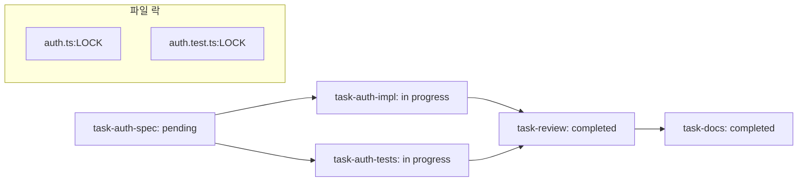
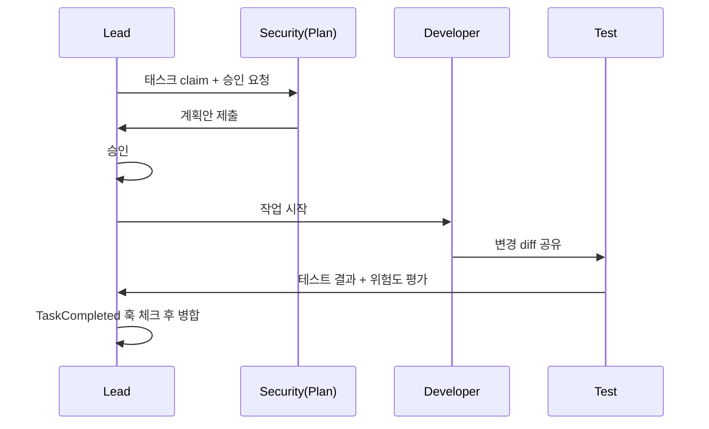

> **TL;DR**
> The real power of Agent Teams does not come from adding more teammates. It comes from **controlling teammates precisely**, managing task dependencies, and adding **quality gates**. This is not micromanagement; it is adding a collaboration protocol.

## 1) Advanced teammate control: model selection and plan approval

Specifying only a role only gets you halfway. In practice, you need to define who does what, with which model, and at what stage.

```text
Create a team with 4 teammates to refactor these modules in parallel. Use Sonnet for each teammate.
```

For higher-risk work, add an approval step up front.

```text
Spawn an architect teammate to refactor the authentication module. Require plan approval before they make any changes.
```

With this pattern, teammates do not modify immediately. They:
1) Submit a plan first,
2) Lead approves or pushes back,
3) Execute only after approval.

This flow minimizes rework from skipped plan checks.

### Practical tips
- High-risk tasks like security and major refactors: **plan-first**
- Simple research or documentation: execute directly
- Predefine default model per teammate (e.g., Sonnet/Opus/Haiku)

## 2) Advanced task system: dependencies, self-claim, and file locks

The default flow is `pending -> in progress -> completed`. Advanced usage adds dependency tracking and occupancy control.



- When transitioning from `pending` to `in progress`, check prerequisite completion first.
- A teammate may claim a task and only then move it to `in progress`.
- Use **file lock rules** so two teammates cannot edit the same file at the same time.

Even though a lead can assign in parallel from the `pending` list alone, tasks with dependencies can be handled safely with teammate self-claim too. For example, even if a testing teammate claims a task, tests still need to wait until implementation is complete.

## 3) Custom subagents: the Lego blocks of your team

Built-in subagents are enough to start, but growing teams often need custom agents.

The official precedence is:

`CLI flag > .claude/agents/ > ~/.claude/agents/ > Plugin agents/`

Declare agents in `.claude/agents/` and match role when creating a team.

```yaml
# .claude/agents/code-reviewer.md
name: code-reviewer
description: security-aware code reviewer
model: sonnet
tools:
  - read
  - edit
  - exec
system: |
  당신은 코드 리뷰 전문 에이전트입니다.
  보안, 타입 안정성, 예외 처리 포인트를 우선 찾으세요.
  변경 권고는 최소 diff를 원칙으로 제시합니다.
permissions: read-write
```

Then include context like: use `code-reviewer` as the architecture reviewer role.

## 4) Build quality gates with Hooks

Official docs highlight two key hooks:
- `TeammateIdle`: just before a teammate enters idle
- `TaskCompleted`: immediately when a task is marked complete

If either returns exit code 2, completion can be routed back to a verification/iteration loop.

### Minimal sample hook script

```bash
#!/usr/bin/env bash
# hooks/keep_working.sh
set -e
echo "[Hook] 더 확인할 포인트가 있습니다."
echo "- 테스트 결과 스크린샷 첨부"
echo "- 변경 라인 이유(why) 3줄 요약"
exit 2
```

Attach this to `TeammateIdle` to prevent teammates from wrapping too early and force a missed-case checklist.
`TaskCompleted` hooks are useful when you need to enforce checks like “run one more regression test before finalizing.”

## 5) End-to-end workflow example

### Scenario: Refactoring an authentication module

1. Lead registers backlog as tasks.
2. Define dependencies:
   - `spec` first → `impl` in parallel prep → `tests` after dependencies → `docs`
3. Assign roles
   - Security lead (plan-first): policy review
   - Developer: logic changes
   - Test lead: contract + regression cases
4. Merge only after completion hook validation.



The lead is less a conductor and more a bottleneck monitor. Even with autonomous teammates, final integration quality remains the lead’s responsibility.

## 6) Cost-management tips and limitations

Token cost is the expected downside of Teams, so you need operating rules.

- Start with 2 or 3 teammates, and avoid unnecessary parallelism.
- Don’t create a team for tasks that only need one teammate.
- Use `Subagents` for simple lookups or documentation, and Team only where discussion is needed.
- Use hooks to prevent repeated idle loops and needless refresh cycles.
- `CLAUDE_CODE_EXPERIMENTAL_AGENT_TEAMS=1` is still experimental, so validate critical releases in smaller pipelines first.

There are clear limits:

- More parallelism = higher cost
- Too large a team leads to responsibility diffusion and slower decisions
- Longer logs make debugging harder

In short, advanced usage shines with **small teams + clear rules + hook gates + strict cost boundaries**.
