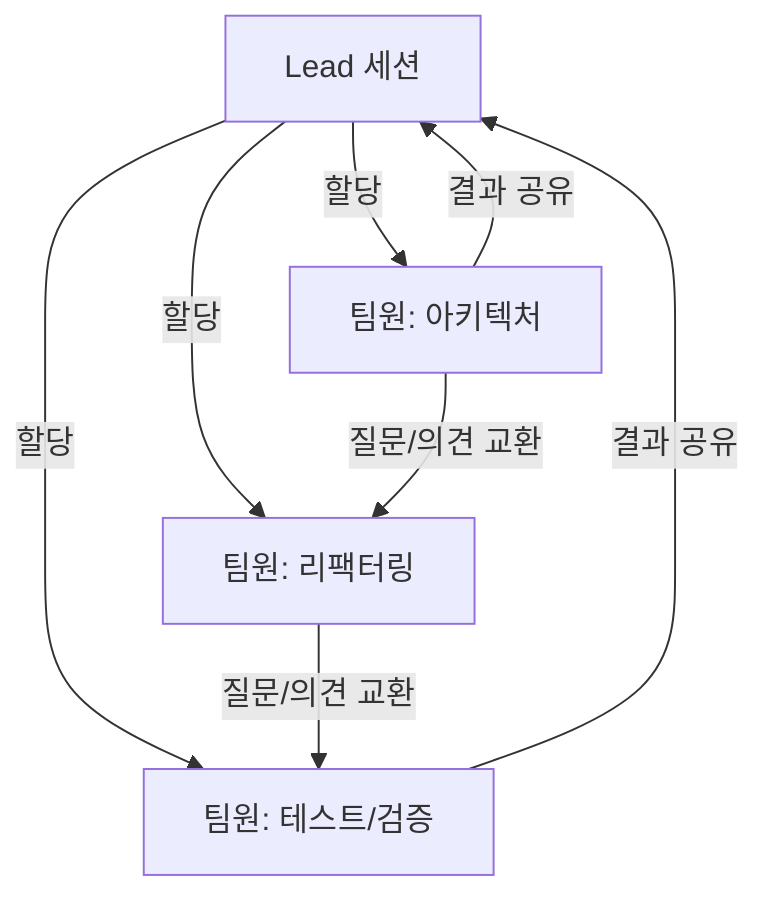
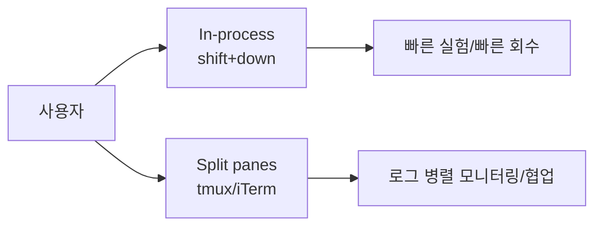

> **TL;DR**
> `Claude Code Agent Teams` lets several Claude instances move together like a real team. When a single agent cannot hold everything in one context, or when parallel work is needed, switching to team mode can improve both speed and quality at the same time. The key is to understand the structure: a `lead` coordinates, and teammates execute their assigned work in independent contexts.

## 1) Why do we need Agent Teams?

When I work on complex tasks, I often see the same question repeated to AI still produce different answers. The reasons are simple:

- If too many goals go into one context, quality gets fuzzy.
- Without parallel verification, missing a bug is easy.
- If `suggestion → review → deployment checks` all happen in one window, the risk surface grows.

A good way to think about this is a **restaurant analogy**. If one chef tries to do chopping, sautéing, and seasoning alone, fatigue and mistakes pile up. Similarly, a single model doing everything tends to hit a bottleneck. With a team, ownership is clearer.

In construction, an architect, electrician, and interior designer each design their part while a lead integrates everything. That’s the same dynamic here.

## 2) What is an Agent Team?

In short, it is a feature that bundles multiple Claude Code instances as one project team.



Core points

- **Lead**: Orchestrates the work, assigns tasks, and resolves conflicts
- **Teammate**: Executes assigned tasks in an independent context
- **Direct communication**: Teammates can message each other without going only through the lead

## 3) Subagents vs Agent Teams (quick comparison)

The official docs compress to the key differences below.

| Category | Subagents | Agent Teams |
|---|---|---|
| Context | Independent windows, return only results | Independent windows, fully autonomous |
| Communication | Report only to main agent | Teammates can message each other directly |
| Coordination | Main agent manages everything | Self-coordination via shared task list |
| Best fit | Focused work where only output is needed | Complex work needing discussion and collaboration |
| Token cost | Lower | Relatively higher |


## 4) Enable team mode and start your first team

First, enable the experimental feature.

```bash
# terminal
export CLAUDE_CODE_EXPERIMENTAL_AGENT_TEAMS=1
```

Or set it permanently in `settings.json`:

```json
{
  "env": {
    "CLAUDE_CODE_EXPERIMENTAL_AGENT_TEAMS": "1"
  }
}
```

Then ask for a team in natural language.

```text
I'm designing a CLI tool. Create an agent team: one on UX, one on architecture, one as devil's advocate.
```

A practical starting point is usually 2 to 4 teammates. Beyond 5, collaboration noise often increases.

## 5) Display modes: In-process vs Split panes

### In-process
- Runs teammates in one main terminal session
- **Shortcut**: switch teammates with `Shift+Down`
- Great for getting started quickly and keeping the screen tidy

### Split panes
- Runs one teammate per panel in terminals like `tmux`, `iTerm2`
- Advantage: monitor multiple teammate logs at the same time
- Trade-off: needs wider screen space and a bit more terminal choreography

In practice, `In-process` works well for small bug fixes, while `Split panes` is usually better for big refactors or debugging races.



## 6) Three real-world scenarios

### Scenario 1) One feature, three perspectives
When adding a feature, having three teams look at design, performance risk, and security in parallel can reduce solo back-and-forth reviews later.

### Scenario 2) Bug-tracking race
One teammate reproduces the bug, one creates a minimal repro case, and another adds tests, while the lead integrates the results. This shortens the loop from hypothesis to confirmation to fix.

### Scenario 3) Code and docs running together
Have one teammate implement code, another draft the user guide, and another build the release checklist. This helps reduce missing docs right before release.

## Conclusion

At first, you may wonder: “Do we really need a team?”

> A single model can sometimes do every role, but most of the time it simply cannot.

Agent Teams are not magic. When used properly, they provide structure for parallelism, verification, and better communication. In the next post, we will go one level deeper and cover model selection, plan approval, task dependencies, and hooks.
