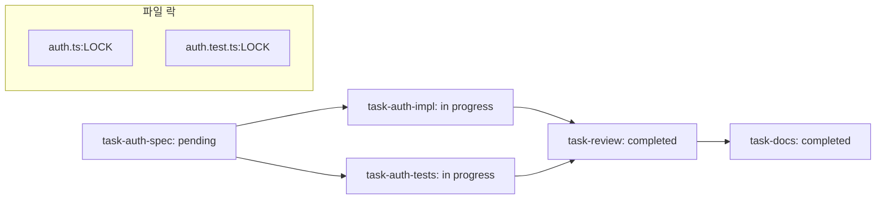
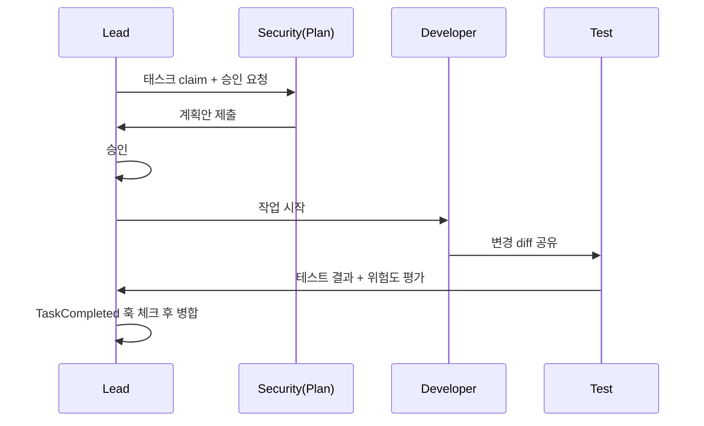

> **TL;DR**
> Agent Teams의 진짜 힘은 팀원 수를 늘리는 데서 시작하지 않는다. **팀원을 정확히 제어하고**, **태스크 의존성을 관리하며**, **품질 게이트를 걸어**야 한다는 것이다. 즉, "마이크로 매니지먼트"가 아니라 "협업 프로토콜"을 붙이는 일이다.

## 1) 팀원 제어 심화: 모델 지정과 계획 승인

팀을 만들 때 역할만 지정하면 반은 성공, 반은 아마 실패입니다. 실제로는 **누가 어떤 모델로, 언제 무엇을 할지**를 먼저 규정해야 합니다.

```text
Create a team with 4 teammates to refactor these modules in parallel. Use Sonnet for each teammate.
```

특정 작업은 무조건 승인 절차를 넣는 게 좋습니다. 예시:

```text
Spawn an architect teammate to refactor the authentication module. Require plan approval before they make any changes.
```

이렇게 하면 팀원은 바로 수정하지 않고
1) 작업 계획을 먼저 제시,
2) 리드가 찬/반박,
3) 승인 뒤 실행,
순으로 진행됩니다. 결과적으로 "먼저 계획 확인→재작업 최소화”가 가능합니다.

### 실전 팁
- 보안/리팩터링 같이 리스크가 큰 작업: **Plan-first**
- 간단한 리서치/문서화: 바로 실행 모드
- 팀원별 기본 모델(예: Sonnet/Opus/Haiku)까지 미리 정해두기

## 2) 태스크 시스템 심화: 의존성과 자체 claim, 파일 락

기본 플로우는 `pending -> in progress -> completed`입니다. 고급 사용은 여기서 멈추지 않고 의존성과 점유 제어를 넣습니다.



- `pending`에서 `in progress`로 넘어갈 때는 **선행 작업 완료 여부** 확인
- 팀원이 직접 task를 claim하면 `in progress` 전환
- 같은 파일을 두 팀원이 동시에 건드리지 못하게 **파일 락 규칙** 운용

`pending` 상태만 보고도 팀 리더가 병렬할당을 할 수 있지만, **의존성 있는 작업**은 팀원 자체 claim으로도 안전하게 처리할 수 있습니다. 예를 들어 구현 팀원이 테스트 태스크를 자진 claim하더라도, 테스트는 구현 완료를 기다려야 하겠죠.

## 3) 커스텀 서브에이전트: 팀의 레고 블록

내장 서브에이전트만으로도 시작은 충분하지만, 조직이 커지면 맞춤형 에이전트가 필요합니다.

공식 우선순위는 다음입니다.

`CLI flag > .claude/agents/ > ~/.claude/agents/ > Plugin agents/`

`.claude/agents/`에 아래처럼 선언하고, 팀 생성 시 역할과 매칭하면 됩니다.

```yaml
# .claude/agents/code-reviewer.md
name: code-reviewer
description: security-aware code reviewer
model: sonnet
tools:
  - read
  - edit
  - exec
system: |
  당신은 코드 리뷰 전문 에이전트입니다.
  보안, 타입 안정성, 예외 처리 포인트를 우선 찾으세요.
  변경 권고는 최소 diff를 원칙으로 제시합니다.
permissions: read-write
```

이후 팀 생성에 "아키텍처 리뷰어 역할로 code-reviewer 사용"처럼 맥락을 주면 역할이 명확해집니다.

## 4) Hooks로 품질 게이트 만들기

공식 문서에서 강조하는 두 가지 훅은 다음입니다.
- `TeammateIdle`: 팀원이 잠수(Idle) 상태로 넘어가기 직전
- `TaskCompleted`: 태스크 완료 즉시

둘 다 `exit code 2`를 보내면 “완료가 아니라 재확인/수정 루프”로 돌려보낼 수 있습니다.

### 최소 샘플 훅 스크립트

```bash
#!/usr/bin/env bash
# hooks/keep_working.sh
set -e
echo "[Hook] 더 확인할 포인트가 있습니다."
echo "- 테스트 결과 스크린샷 첨부"
echo "- 변경 라인 이유(why) 3줄 요약"
exit 2
```

`TeammateIdle` 훅에 붙이면 팀원이 급히 쉬려 할 때 “아직 놓친 케이스” 체크리스트를 띄워 계속 작업하게 만들 수 있고,
`TaskCompleted` 훅은 “마무리 전에 회귀 테스트 1개 더” 같은 체크를 강제할 때 유용합니다.

## 5) 실전 프로젝트 워크플로우 예제

### 시나리오: 인증 모듈 리팩터링

1. 리드가 백로그를 task로 등록
2. 의존성 정의
   - `spec` 선행 → `impl` 병렬 준비 → `tests` 의존 실행 → `docs`
3. 역할 할당
   - 보안 담당(Plan-first): 인증 정책 점검
   - 구현 담당: 로직 변경
   - 테스트 담당: 계약/회귀 케이스 작성
4. 완료 훅 확인 후 합치기



리드의 역할은 결국 “총지휘자”가 아니라 “병목 감시자”에 가깝습니다. 팀원이 자율적으로 움직여도, 마지막 통합 품질의 책임은 여전히 리드에게 있어요.

## 6) 비용 관리 팁 & 한계

토큰 비용이 늘어나는 건 Team의 당연한 단점입니다. 그래서 운영 규칙이 필요합니다.

- 팀원은 최소 2~3명으로 시작 (불필요한 과잉 병렬 자제)
- 한 작업에 1개 팀원만 필요하면 굳이 팀 생성 안 함
- 단순 조회/문서화는 `Subagents`로 처리하고, 토론이 필요한 부분만 Team 사용
- 훅으로 `idle` 반복 방지, 불필요 스크롤/반복 리프레시 억제
- `CLAUDE_CODE_EXPERIMENTAL_AGENT_TEAMS=1`은 실험 기능이므로, 중요한 릴리스는 먼저 소규모 파이프라인에서 검증

한계도 분명합니다.

- 병렬성 증가 = 비용 증가
- 너무 큰 팀은 책임 분산으로 결정 지연
- 로그가 길어지면 디버깅 난이도 상승

즉, 고급 기능은 **작은 팀 + 명확한 규칙 + 훅 게이트 + 비용 경계**의 조합에서 가장 빛납니다.
