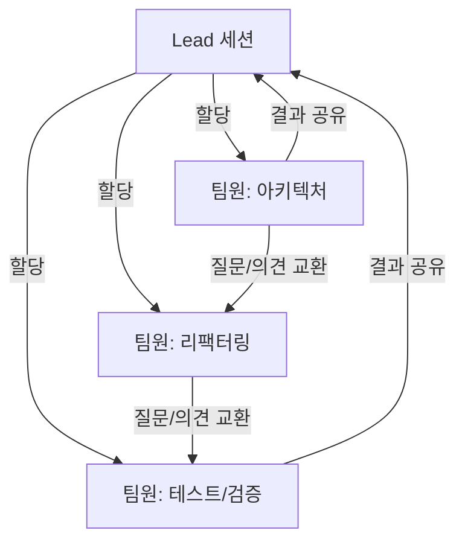
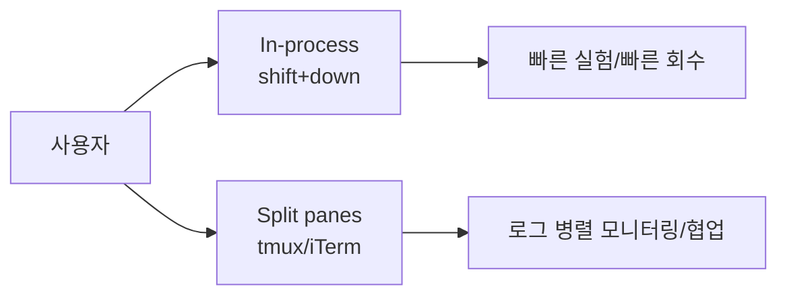

> **TL;DR**
> `Claude Code Agent Teams`는 여러 Claude 인스턴스를 한 팀처럼 움직이게 하는 기능이다. 단일 에이전트로는 맥락 하나에 모든 걸 담기 어렵거나 병렬성이 필요한 작업에서, 팀 모드로 전환하면 속도와 품질을 동시에 끌어올릴 수 있다. 핵심은 `리드`가 조율하고, 팀원은 독립 컨텍스트에서 맡은 일을 진행하는 구조를 이해하는 것이다.

## 1) 왜 'Agent Teams'가 필요한가?

저는 작업을 많이 하다 보면, AI를 세 번 불러도 결국 답이 계속 번복되는 걸 보게 된다. 이유는 간단해요.

- 한 번의 컨텍스트에 너무 많은 목표가 들어가면, 결과가 흐려진다.
- 병렬 검증이 안 되면 버그 하나를 놓치기 쉽다.
- “코드 제안 → 리뷰 → 배포 체크”를 모두 같은 창에서 하면 사고가 겹친다.

이때 **팀화**가 답입니다. 요리사 비유로 하면, 혼자 요리사가 칼질, 볶음, 양념 다 하다가 지치듯이 한 모델이 모든 일을 하면 멈춤이 생깁니다. 반대로 팀은 역할이 분명해져요. 건축에서 건축가, 전기공, 미관 담당이 각자 설계하고 리드가 최종 통합하듯이요.

## 2) Agent Teams는 어떻게 생겼나?

간단히 말해 **여러 Claude Code 인스턴스를 하나의 프로젝트 팀처럼 묶는 기능**입니다.



핵심 포인트

- **리드(lead)**: 작업을 총괄하고 태스크를 배정, 충돌 조정
- **팀원(teammate)**: 독립 창에서 각자의 작업을 수행
- **직접 소통**: 팀원끼리 직접 메시지 가능 (메인만 경유하지 않음)

## 3) Subagents와 무슨 차이인가? (한 번에 보는 표)

공식 문서의 핵심만 압축하면 아래와 같습니다.

| 항목 | Subagents | Agent Teams |
|---|---|---|
| 컨텍스트 | 독립 윈도우, 결과만 반환 | 독립 윈도우, 완전 독립 |
| 소통 | 메인 에이전트에만 보고 | 팀원끼리 직접 메시지 |
| 조율 | 메인 에이전트가 관리 | 공유 태스크 리스트로 자체 조율 |
| 적합한 경우 | 결과만 필요한 집중 작업 | 토론/협업이 필요한 복잡한 작업 |
| 토큰 비용 | 낮음 | 상대적으로 높음 |


## 4) 팀 활성화와 첫 팀 시작

먼저 실험 기능을 켜야 합니다.

```bash
# 터미널
export CLAUDE_CODE_EXPERIMENTAL_AGENT_TEAMS=1
```

또는 `settings.json`에 고정:

```json
{
  "env": {
    "CLAUDE_CODE_EXPERIMENTAL_AGENT_TEAMS": "1"
  }
}
```

이제 자연어로 팀을 요청하면 됩니다.

```text
I'm designing a CLI tool. Create an agent team: one on UX, one on architecture, one as devil's advocate.
```

보통 바로 팀원 2~4명부터 시작하면 부담이 적고, 5명 이상은 협업 노이즈가 늘어날 수 있어요.

## 5) 디스플레이 모드: In-process vs Split panes

### In-process
- 하나의 메인 터미널에서 팀원이 동시 실행
- **단축키**: `Shift+Down`으로 팀원 전환
- 간단히 시작하기 좋고 화면이 깔끔

### Split panes
- `tmux`, `iTerm2` 등 분할 터미널에서 팀원별 패널 실행
- 장점: 각 팀원 작업 로그를 동시에 확인 가능
- 단점: 화면이 넓어야 하고 터미널 제어가 살짝 번거로움

실무에서는 “작은 버그 수정”은 In-process, “큰 리팩터링/디버그 경주”는 Split panes가 더 쾌적합니다.



## 6) 실전 시나리오 3가지

### 시나리오 1) 기능 하나, 관점 3개
새 기능을 넣을 때 “기능 설계”, “성능 리스크”, “보안” 3개 시선을 분리해서 동시에 받으면, 나중에 나 혼자 회의하는 시간을 줄일 수 있습니다.

### 시나리오 2) 버그 추적 레이스
버그 재현, 최소 재현 코드 생성, 테스트 추가를 각 팀원이 맡고 리드가 결과를 통합하면 ‘원인 추정→확인→수정’ 루프가 빨라집니다.

### 시나리오 3) 문서 + 코드 동시 진행
한 팀원이 구현, 다른 팀원이 사용 가이드 초안, 또 다른 팀원이 체크리스트를 만드는 방식은 릴리스 직전 문서 누락을 줄이는 데 꽤 효과적입니다.

## 마무리

처음엔 “굳이 팀이 필요한가?” 하는 의문이 들 수 있어요. 그럴 땐 이렇게 생각해 보세요.

> 하나의 모델이 모든 역할을 다 해도 되는 건 가끔, 다 하진 못할 일이 대부분일 때는 팀을 쓰는 게 더 낫다.

Agent Teams는 마법이 아니라, 제대로 쓰면 작업의 병렬성·검증성·소통의 구조를 만들어 주는 도구입니다. 다음 편에서는 설정을 한 단계 더 깊게 들어가서 모델 지정, 계획 승인, 태스크 의존성, Hooks까지 정리해 보겠습니다.